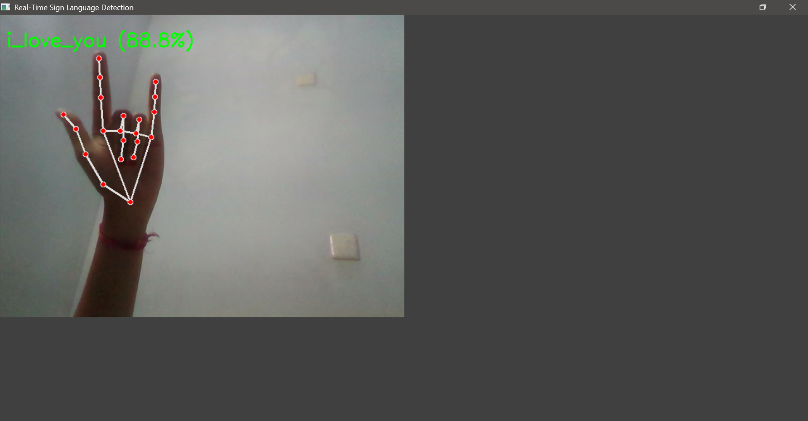

# ✋ Real-Time Sign Language Detection

An **AI-powered hand gesture recognition** system that detects and classifies **sign language gestures in real-time** using **MediaPipe** and **TensorFlow/Keras**.  
This lightweight application processes live webcam input and identifies gestures such as **Hello**, **Thank You**, **Yes**, **No**, and **I Love You**.

---

## 🚀 Features

- Capture and process hand gestures using **MediaPipe Hand Tracking**  
- Train a custom gesture classification model using **TensorFlow/Keras**
- Detect gestures from **live webcam feed** in real-time  
- Lightweight and easy to customize (no large datasets required)
- Simple and clean code structure for beginners  

---

## 🛠 Tech Stack

- **Framework & Language**: Python (3.9+)
- **Computer Vision**: [OpenCV], [MediaPipe]
- **Deep Learning**: [TensorFlow / Keras] 
- **Data Processing**: [NumPy], [scikit-learn]
- **Visualization**: Matplotlib 

---

## 📂 Project Structure

Real-Time Sign Language Detection/
│
├── data/
│ ├── label_map.json    
│ ├── X.npy     
│ └── y.npy     
│
├── dataset/
│ ├── hello/    
│ ├── i_love_you/
│ ├── no/
│ ├── thank_you/
│ └── yes/
│
├── models/
│ ├── best_model.h5     
│ ├── final_model.h5    
│ ├── scaler_mean.npy   
│ └── scaler_scale.npy  
│
├── source/
│ ├── capture_images.py     
│ ├── extract_landmarks.py  
│ ├── realtimedetection.py  
│ └── train.py  
│
├── venv/  
├── .gitignore  
├── README.md   
└── requirements.txt 

---

## 🖼️ Project Preview

Here’s a quick look at the **Real Time Sign Language Detection** app in action!  
It captures real-time hand gestures via webcam and predicts corresponding signs such as *Hello*, *Thank You*, *Yes*, *No*, and *I Love You* with a trained deep learning model.

  

